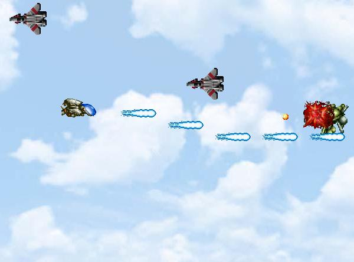

## A simple shooting game

### Description

a very very simple shooting game. this is the first time I write classes in vb, so my OOD isnt very good (very poor actually). and because i lacked the graphics, so i captured some pictures from some sources (if anyone objects my use of those graphics PLEASE let me know and i'll remove them)

And, please vote and leave a comment!

(due to time limit, the game is obviously unfinished, so if you vote badly because of that, i have nothing to say...)
 
### More Info
 

             |
---                |---
**Submitted On**   |2001-01-07 21:47:58
**By**             |[Kaki Cheung](https://github.com/Planet-Source-Code/PSCIndex/blob/master/ByAuthor/kaki-cheung.md)
**Level**          |Intermediate
**User Rating**    |4.5 (50 globes from 11 users)
**Compatibility**  |VB 6\.0
**Category**       |[Games](https://github.com/Planet-Source-Code/PSCIndex/blob/master/ByCategory/games__1-38.md)
**World**          |[Visual Basic](https://github.com/Planet-Source-Code/PSCIndex/blob/master/ByWorld/visual-basic.md)
**Archive File**   |[CODE\_UPLOAD13526182001\.zip](https://github.com/Planet-Source-Code/kaki-cheung-a-simple-shooting-game__1-14242/archive/master.zip)

